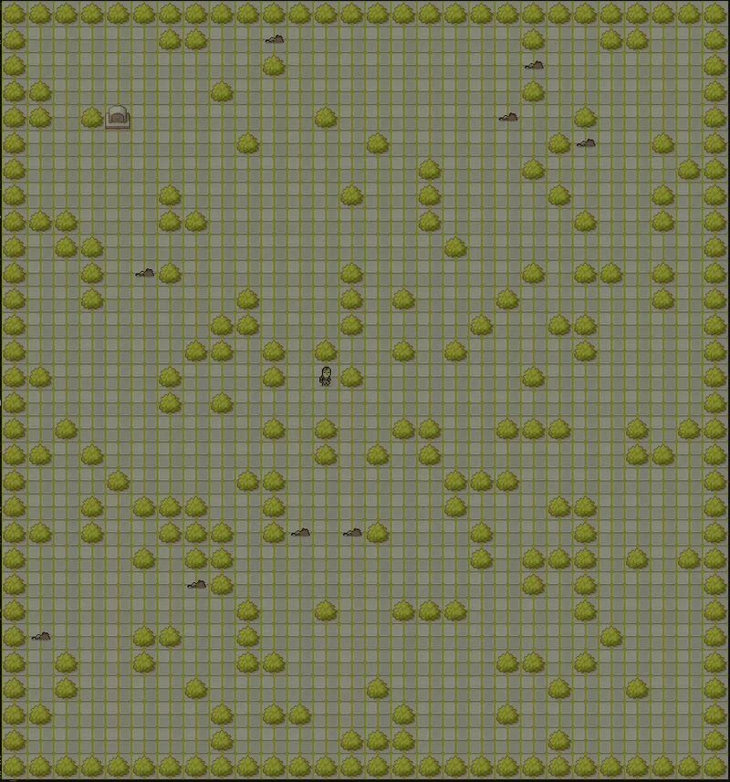

so_long (Linux)
================================

Petit jeu 2D réalisé avec MiniLibX (projet 42). Le joueur doit récupérer toutes les collectibles puis atteindre la sortie.

Installation
------------

- Prérequis: `cc`, `make`, MiniLibX déjà inclus dans le dépôt.
- Cloner le projet puis, à la racine, lancer `make` pour construire l'exécutable `so_long`.

Lancer le jeu
-------------

- Construire: `make`
- Exécuter: `./so_long map.ber`.
- Nettoyer les binaires: `make clean` ; tout nettoyer: `make fclean`.

Contrôles
----------

- Déplacements: `W`/`A`/`S`/`D` ou les fleches.
- Quitter: `Esc` ou fermer la fenêtre.

Cartes
------

- Les cartes sont des fichiers `.ber` dans `maps/`.
- Un script `generate.sh` est disponible afin de generer de nouvelles maps.
- Chaque carte doit être rectangulaire et entourée de murs, contenir au moins une sortie `E`, un joueur `P` et un collectible `C`.
